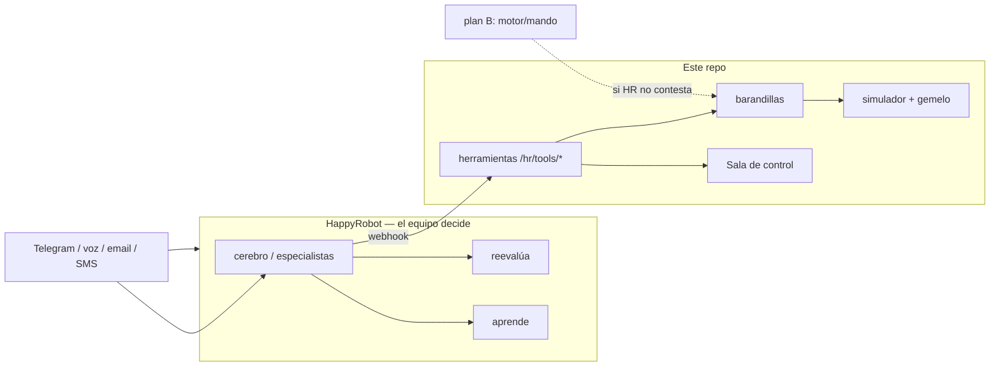

# MANDO

**Un equipo de agentes en HappyRobot decide; este repo es su mundo, sus herramientas, sus barandillas y la Sala de control.**

HackSpain 2026 · reto HappyRobot · equipo FABAT. Festival ficticio: si hay una emergencia de verdad, llama al 112.

> [`GUIA.md`](GUIA.md) · [`COMO-DECIDE.md`](COMO-DECIDE.md) · [`COBERTURA-RETO.md`](COBERTURA-RETO.md) · [`docs/PLAN-GIRO.md`](docs/PLAN-GIRO.md)

## Cómo está montado



El coordinador reparte a triaje, prioridad, recursos, avisos, vigía y crítico. El backend **no elige** el plan: da contexto, deja ensayar en el gemelo, aplica barandillas y ejecuta lo permitido. Evacuar / parar / ayuda externa → siempre una persona en la Sala. Riesgo vital → despacho médico aunque el agente calle.

## Arrancar (3 comandos)

Python ≥ 3.12 y [`uv`](https://docs.astral.sh/uv/). Sin claves: todo simulado y rotulado.

```sh
./mvp.sh          # Sala: http://127.0.0.1:8000   público: /asistente   jurado: /jurado
./mvp.sh check    # tests del núcleo y del servidor
./mvp.sh lan      # lo mismo, visible en la wifi (QR)
```

`./mvp.sh demo` deja la escena pausada. `./mvp.sh real` usa HappyRobot y Telegram (copia `.env.example` → `.env`). Puente: `npm --prefix puente test`.

## Dónde está cada cosa

| Carpeta | Qué es |
|---|---|
| `motor/happyrobot/` | Prompts del equipo y contrato de herramientas |
| `motor/server/` | Backend: herramientas, barandillas, Sala (`static/sala*`), APIs |
| `motor/world/` | Recinto simulado y gemelo |
| `motor/mando/` | Plan B de reglas (si el equipo no contesta a tiempo) |
| `motor/cases/` `harness/` `baseline/` `caos/` | Casos, banco de medida, lista fija, adversario |
| `puente/` | Telegram en Vercel → backend |
| `docs/` | Plan del giro, inventario, limpieza |
| `archivo/` | Lo que ya no es la demo (no se borra) |

Supervisión: **`/` Sala**. Público: `/asistente`. Jurado: `/jurado`. Llamada web: `/llamada/<id>`.

## Qué es real y qué es simulado

| | Real (si hay credenciales) | Simulado |
|---|---|---|
| Recinto, aforo, incidentes del caso | — | Todo |
| Aviso del público | Telegram o `/asistente` | Banco de pruebas |
| Quién decide | Equipo en HappyRobot (o LLM local) | Reglas solo como plan B, rotulado |
| Llamada / despacho | Plataforma + lista blanca `MANDO_ALLOWED_NUMBERS` | `SimComms`, la pantalla lo dice |
| Lo grave | Persona en la Sala | Operador simulado en el banco |
| Cifras `harness` | — | Cada una lleva su N |

Nunca se marca un 112 real. Secretos solo en `.env` (repo público).

Herramientas: [`motor/happyrobot/cerebro/HERRAMIENTAS.md`](motor/happyrobot/cerebro/HERRAMIENTAS.md). Mapa: [`docs/INVENTARIO.md`](docs/INVENTARIO.md). Lo movido: [`docs/LIMPIEZA.md`](docs/LIMPIEZA.md).
