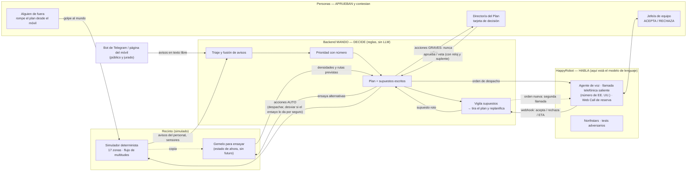

# MANDO

**Sabe cuándo su plan ha dejado de valer.**

> **In English (30 seconds).** MANDO is an incident-coordination agent for a 40,000-person open-air concert. Every
> plan it makes carries its **written assumptions** ("south corridor is passable", "Gate A stays below 4 people/m²").
> Before acting, it **rehearses the decision in a digital twin of the venue**; that rehearsal is what writes the
> assumptions. When one breaks — sometimes because of MANDO's own decision, sometimes because an outsider breaks it
> from their phone — MANDO drops the plan by itself and builds a new one, saying why. The public reports through a
> **Telegram bot**; MANDO can place **phone calls through HappyRobot** (workflows mounted on the platform; with
> credentials and an allowlisted number) to team leads, who ACCEPT or REJECT. Grave actions (stop the show, evacuate,
> open the gates) are never taken by the machine: a named person gets a **decision card** with both rehearsed futures
> and a clock. Measured against a fixed-checklist agent on never-seen simulated cases: run
> `python3 -m motor.harness headline` for the current paired difference with N and 95 % CI; the headline figure is
> published with the final delivery.
> **Honest note:** the decision core is a deterministic closed-loop planner with rules — no LLM. The language model
> lives where language is: in the phone conversation. The venue and the incidents are simulated; reports, calls and
> human approvals can be real in a configured demo, or fully simulated when credentials are missing (the UI labels it).

HackSpain 2026 · reto HappyRobot «¿Puede la IA gestionar una crisis?» · equipo FABAT · construido en 36 horas.

---

> **Por dónde empezar:** [`GUIA.md`](GUIA.md) (cómo levantarlo, cómo se usa desde el público y desde el control, y cómo probar cada función) · [`COMO-DECIDE.md`](COMO-DECIDE.md) (cómo prioriza, a quién llama y cuándo tira el plan, con las fórmulas reales) · [`COBERTURA-RETO.md`](COBERTURA-RETO.md) (qué cubre del reto y cómo demostrarlo en 30 segundos).

## El problema

Houston, 5 de noviembre de 2021, festival Astroworld. La primera llamada al 911 entra a las **21:07**. La parada del
concierto se inicia a las 21:39, el incidente de múltiples víctimas se declara a las 21:47 y el concierto termina a
las **22:12**. Son **65 minutos con información y sin decisión**; murieron diez personas.
*Fuente: cronología de la policía de Houston, publicada por ABC13.*

En los grandes fallos de gestión de multitudes la información casi siempre existía. Lo que falla es lo que viene
después: quién decide, con qué dato, hasta cuándo, y qué pasa cuando el plan que se eligió deja de ser verdad.
Un centro de control despacha **en serie**, por una radio que lleva una persona; en el pico hay muchos incidentes a la
vez y, además, el teléfono del centro (proveedores, transporte, relevos, servicios externos) se hunde.

## Qué hace

1. **Recibe avisos** (personal, sensores de aforo y público; el público escribe a un **bot de Telegram** o a una
   página del móvil), fusiona duplicados, aparta bromas y falsas alarmas y pregunta cuando el aviso es ambiguo.
2. **Prioriza con un número** que se explica en una línea:
   `prioridad 8,8 = gravedad 7 × plazo 10 min × densidad 5,8/m² × tendencia × confianza`.
3. **Ensaya antes de actuar.** Toda decisión con efecto sobre flujos o rutas (un desvío de puerta, una ruta
   sanitaria) se prueba en un **gemelo del recinto**: copia del estado de ahora, sin futuro. El ensayo elige entre
   alternativas con un criterio fijo (nadie por encima de 6,5 personas/m²; menos minutos por encima de 4/m²; pico más
   bajo; la opción menos intrusiva) y **escribe los supuestos del plan**: «válido mientras Puerta A < 4/m²».
4. **Despacha por voz.** Lo urgente no espera a nadie: en una posible parada el equipo a pie sale al instante. La
   orden se da con un **workflow de voz de HappyRobot** (teléfono o Web Call) al móvil de quien manda el equipo, que
   contesta ACEPTA o RECHAZA; si rechaza o no contesta, reasigna a la vista. Cuando el plan cambia, vuelve a llamar
   con la orden nueva. Sin credenciales de HappyRobot ni números en lista blanca, las llamadas se simulan y la pantalla
   lo rotula.
5. **Vigila sus supuestos y tira el plan él solo** cuando uno se rompe —también cuando lo ha roto su propia
   decisión— y explica el plan nuevo con su porqué.
6. **No decide lo grave.** Parar el concierto, evacuar, abrir portones, pedir servicios externos o cerrar una zona
   generan una **tarjeta de decisión** dirigida a un cargo con nombre (el Director del Plan de Actuación en
   Emergencias del RD 393/2007): el dato y su tendencia, **los dos futuros ensayados** («si paras: X/m² en N min; si
   no: Y/m² en M min»), un reloj con la ventana de decisión y escalada al suplente si nadie contesta.
   *No decide parar el concierto: hace imposible no decidir.*
7. **Se deja romper.** Una persona de fuera, desde su móvil, corta un pasillo, deja a un equipo sin contestar o
   cierra el metro: tres golpes por partida y un marcador «JURADO — MANDO». Si un golpe provoca un fallo, queda
   bloqueado como test de regresión con el nombre de quien lo provocó y se vuelve a pasar delante de él.
8. **Apunta lo que pasó y propone cambios pequeños.** La pantalla `/memoria` recoge observaciones del día 1 y propone
   cambiar **parámetros**; cada propuesta requiere aprobación humana. Ninguna propuesta puede tocar los niveles de
   autonomía ni los umbrales de seguridad. El impacto medido día 1 → día 2 se obtiene con
   `python3 -m motor.harness day2` (N e intervalo en la entrega).

## Qué tiene de distinto

- **Supuestos escritos.** El plan dice de qué depende; cuando eso deja de ser verdad, se ve en pantalla qué supuesto
  se rompió y por qué nace el plan nuevo.
- **El fallo emerge, no está guionizado.** El recinto es un simulador de flujo de multitudes. En el caso de la Puerta
  B (`demo-gates`), el agente de lista fija sigue su protocolo y deja que la puerta se sature; MANDO ensaya en el
  gemelo desviar a la A, a la C o no desviar —desviarlo *todo* a la A la saturaría—, elige destino y fracción y
  mantiene la Puerta B por debajo del umbral. *(Un caso de demostración; la estadística agregada está más abajo.)*
- **El adversario ataca el mundo, no la conversación.** HappyRobot ya ofrece agentes adversarios que intentan romper
  al agente de voz *hablando* con él. El nuestro amplía esa idea a la capa de al lado: rompe el escenario, los
  recursos y los supuestos del plan.
- **Determinista y auditable.** Mismo caso y misma semilla, misma ejecución, bit a bit. Por eso un fallo se puede
  bloquear como caso de regresión y volver a pasarlo delante de quien lo provocó.

## Arquitectura

El backend decide. HappyRobot habla. Una persona aprueba.



| Pieza | Dónde | Qué es |
|---|---|---|
| `motor/world/` | simulador | Recinto de 40.000 personas y 30.000 m² útiles de público, tick de 1 min, flujo por aristas con tope, colas en puertas, viento por escalones, sensores de aforo por tendencia y umbral, ambulancia que no cruza público, gemelo (`twin()`) |
| `motor/cases/` | casos | 79 tipos de incidente en 9 familias; generador combinatorio con partición `train` / `heldout` / `demo` sin combinaciones compartidas |
| `motor/mando/` | el agente | Parser heurístico, triaje, prioridad, ensayo previo, plan con supuestos, replanificación, niveles de autonomía, informe posterior |
| `motor/baseline/` | referencia | El «agente de lista fija»: misma información, mismos recursos, protocolo por tipo, sin supuestos ni ensayo |
| `motor/caos/` | adversario | Golpes al mundo con presupuesto limitado, elegidos simulando futuros sobre copias |
| `motor/harness/` | banco | N ejecuciones sin pantalla, métricas con intervalo, regresión |
| `motor/server/` | pantalla | FastAPI + SSE: puesto de mando, duelo en pantalla partida, página móvil de quien avisa y rompe el plan, bot de Telegram (*long polling*), tarjeta de decisión, marcador y bloqueo de fallos como test, adaptador de HappyRobot |
| `motor/happyrobot/` | plataforma | Especificación de los workflows de voz (despacho por teléfono, despacho por Web Call), prompts, northstars y escenarios adversarios |

## Cómo se ejecuta en local (3 comandos)

Requisitos: Python ≥3.12 y [`uv`](https://docs.astral.sh/uv/). El núcleo usa solo la biblioteca estándar; solo el
servidor tiene dependencias. No hace falta ninguna clave: sin credenciales de HappyRobot las llamadas se simulan y
la pantalla lo rotula; sin `TELEGRAM_BOT_TOKEN` el bot no arranca y los avisos entran por la página `/jurado`.

```sh
git clone https://github.com/bruuno7/FABAT && cd FABAT
uv run --project motor/server python -m motor.server --case demo-gates --speed 4 --play
open http://127.0.0.1:8000/duelo        # lista fija contra MANDO, mismo caso y misma semilla
```

Otras vistas: `/?escena=1` (puesto de mando en modo escena) · `/jurado` (móvil de quien avisa y rompe el plan; con
`--lan` para abrirlo desde otro dispositivo) · `/informe` (informe posterior con los errores propios).

Pruebas y banco de medida:

```sh
./mvp.sh check                                                 # tests del núcleo, del servidor y doctor
python3 -m motor.world.demo --reroute 6                        # el simulador a pelo: desviar TODO B→A satura la Puerta A
python3 -m motor.harness headline                              # MANDO − lista fija, pareado, con IC 95 %
```

Con HappyRobot de verdad (opcional): variables `HR_API_KEY`, `HR_API_BASE`, `HR_WORKFLOW_DISPATCH` (teléfono) o
`HR_WORKFLOW_WEBCALL`, `MANDO_VOICE_MODE=phone|web_call`, `HR_SECRET` y `--comms happyrobot`; detalle en
`motor/server/README.md`. Ningún secreto ni número de teléfono está en el repo.

## Cómo ejecutar las interfaces (todas)

Un solo servidor sirve todas las pantallas. Requisitos: Python ≥3.12 y [`uv`](https://docs.astral.sh/uv/); nada más.
Sin claves todo funciona en simulado y la pantalla lo rotula.

**1. Arrancar** (elige una):

```sh
./mvp.sh demo     # escena de presentación: caso demo-1, pausada, lista para enseñar      → http://127.0.0.1:8000
./mvp.sh          # todo en local y simulado, con el reloj corriendo
./mvp.sh lan      # igual, pero accesible desde los móviles de la misma wifi (QR en pantalla)
./mvp.sh real     # con HappyRobot y Telegram reales (antes: copiar .env.example a .env y rellenarlo)
# sin el guion:  uv run --project motor/server python -m motor.server demo --case demo-1 --port 8000
# otro caso:     MANDO_DEMO_CASE=demo-gates ./mvp.sh demo     (puertas saturadas: aquí se ven las PREVISIONES)
```

**2. Abrir la pantalla que toque:**

| Ruta | Para quién | Qué es |
|---|---|---|
| `/` o `/sala` | Responsable del evento / centro de control | **Sala de control** (la interfaz principal): cola de incidentes por gravedad, plano en vivo, recursos, banda «el plan ha dejado de valer», ficha con plan y supuestos, tarjeta de decisión (Aprobar / Vetar), mesa de inyección, columna «Agente HR» |
| `/centro` | Centro de control (alternativa) | Misma información en otra disposición, con los avisos **PREVISTOS** del gemelo y su cuenta atrás, y la franja de servicios |
| `/clasico` | Vista técnica / plan B del vídeo | Pantalla oscura original; `E` = modo escena |
| `/asistente` | Público (móvil) | Chat que guía a quien avisa, pregunta lo que falta y da la instrucción de seguridad; cada pestaña es una sesión distinta |
| `/jurado` | Jurado (móvil) | Avisar y «romper el plan» con golpes predefinidos (presupuesto limitado) |
| `/caos` | Operador | Mesa de imprevistos completa (exige operador) |
| `/duelo` | Vídeo / sala | Pantalla partida: lista fija contra MANDO, mismo caso y misma semilla |
| `/memoria` | Operador | Día 1 → día 2: lo observado, lo que se propone cambiar y su aprobación |
| `/informe` | Después del evento | Informe posterior, con los errores propios |
| `/historial` | Operador | Historial guardado en SQLite (`motor/server/BASE-DE-DATOS.md`): incidentes, decisiones, equipos, export |
| `/curva` | Pitch | Curva de degradación con la carga |
| `/llamada/<id>` | Quien recibe una orden | Llamada web de HappyRobot (o simulada) |

**3. Teclas** (en `/`, `/centro` y `/clasico`): `espacio` arranca o pausa · `S` avanza un minuto · `K` salta al momento
clave (justo antes de que se rompa un supuesto) · `R` reinicia la escena · `A` / `V` aprueba o veta la tarjeta de
decisión · `E` modo pantalla grande · `Esc` cierra la ficha.

**4. Operador.** En local no pide nada. Si el servidor se expone (túnel o wifi), define `MANDO_OPERATOR_TOKEN` (o varios
operadores con `MANDO_OPERATORS=nombre:papel:token,…`) y entra por `/acceso`; el token nunca va en la URL.

**5. Editar la interfaz.** La Sala de control son cuatro ficheros estáticos, sin build: `motor/server/static/sala.html`,
`sala.css` (colores y tipografía: variables al principio), `sala.js` y `sala-plano.js` (el plano). Se guarda y se recarga
el navegador. Los datos salen de `GET /api/state` y del SSE `/api/stream`; las acciones, de `/api/approve`,
`/api/control`, `/api/strike`, `/api/whatif` y `/api/chat`. Contrato completo, con ejemplos reales, en
`motor/server/CONTRATO-INTERFAZ.md` (sirve también para montar otra interfaz, p. ej. Next.js, contra el mismo backend:
lista blanca de orígenes en `MANDO_CORS_ORIGINS`).

**6. Probar sin plataforma.** `POST /api/demo/telegram` (operador) reproduce en la Sala un despacho de staff por Telegram
(aviso → asignaciones → acepta / rechaza → reasignación → escalada por voz). Evals locales: `python3 -m motor.evals`
(informe en `motor/evals/out/informe.md`). Diagnóstico de configuración: `uv run --project motor/server python -m
motor.server doctor`. Tests: `./mvp.sh check`.

**7. El puente de Telegram** (`puente/`, Node, desplegado en Vercel) va aparte: `npm --prefix puente install &&
npm --prefix puente run dev`; variables en `puente/.env.example`. Un bot de Telegram solo admite un consumidor: si el
webhook lo tiene Vercel, el servidor de MANDO va con `TELEGRAM_MODE=send_only` (o `off`), nunca `poll`.

## Cómo se ha medido

Todo lo de esta sección es **simulación, no dato de campo**, y cada cifra lleva su N.

- **Diseño pareado:** MANDO y la lista fija corren exactamente los mismos casos con las mismas semillas; el banco
  aborta si no coinciden. Se publica la diferencia pareada con su intervalo de confianza al 95 % (bootstrap).
- **La fórmula de puntuación (0–100) se fijó antes de medir a nadie** y está en `motor/harness/metrics.py`. Como parte
  de la nota depende de reglas escritas por nuestro propio generador de casos, publicamos también la variante
  **«solo-mundo»**, que las quita todas y deja lo físico: incidentes críticos que fallan, acciones inseguras,
  lentitud, minutos por encima de 5 personas/m², despachos desperdiciados.
- **Un error cuenta como fallo.** Si el agente o el puntuador revientan en un caso, ese caso puntúa 0 y se queda en el N.
- **Código congelado:** cada informe lleva la huella del código medido; solo publicamos cifras de una única huella.

Para obtener las cifras vigentes (con N, intervalo de confianza al 95 % y huella del código):

```sh
python3 -m motor.harness headline    # titular pareado heldout y train
./mvp.sh cifras                      # mismo titular, atajo desde la raíz
```

La cifra publicada en la entrega sale de ese comando sobre el código congelado de la entrega. Informe completo y
tablas desglosadas: `motor/harness/out/latest/` (generado al ejecutar el banco; no versionado).

| Medida | Cómo obtenerla |
|---|---|
| MANDO − lista fija, casos nunca vistos (`heldout`), sin adversario | `python3 -m motor.harness headline` → bloque `heldout` |
| Variante «solo-mundo» del mismo brazo | mismo comando → columna `solo-mundo` |
| Contra lista fija mejorada (fusiona duplicados y ordena por gravedad) | `python3 -m motor.harness compare --cases motor/cases/data/heldout.jsonl --n 1000` |
| Bajo adversario inteligente o al azar | `python3 -m motor.harness run --chaos smart\|random --n 300` |
| Acciones graves ejecutadas sin aprobación humana | incluido en la agregación del banco (debe ser 0) |
| Degradación con 1–8 incidentes a la vez | `python3 -m motor.harness load` |
| Efecto del ensayo en el gemelo | `python3 -m motor.harness curve` |
| Memoria operativa día 1 → día 2 | `python3 -m motor.harness day2 --n 400` |

**Lo que esta medida NO demuestra.** Mide al planificador dentro de nuestro simulador, con nuestra fórmula y contra
nuestra lista fija. No dice nada de un recinto real. Por eso el producto que proponemos no es «nuestro festival»,
sino el ensayo del plan de autoprotección *del cliente* sobre el plano *del cliente*.

## Qué es real y qué es simulado

| | Real | Simulado |
|---|---|---|
| El recinto, el público y los incidentes | — | **Todo.** Simulador propio, determinista |
| Sensores de aforo | — | Salen del simulador |
| Tiempo del evento | — | Minutos simulados; la pantalla acelera o pausa el reloj |
| Recursos en el recinto (equipos, ambulancias, puertas) | — | Estado del simulador |
| Los avisos del público | **Sí**, en demo configurada: texto libre al bot de Telegram (`puente/` en Vercel → webhooks al backend) o a la página `/asistente` / `/jurado`. El bot avisa de que es una simulación y no un servicio de emergencias | En el banco de pruebas, avisos generados |
| La llamada de despacho | **Montada** sobre workflows de HappyRobot (teléfono o Web Call); el backend lanza el run y recibe webhooks. **Requiere** credenciales, workflows publicados y números en `MANDO_ALLOWED_NUMBERS` | Sin esa configuración, o cuando la plataforma no responde: `SimComms` y la pantalla lo **rotula** («simulada») |
| Quien contesta la llamada | **Puede ser** una persona real con su voz, si la llamada sale de verdad | En local y en el banco, respuestas simuladas |
| Quien aprueba o veta lo grave | **Una persona**, con un botón y un reloj en la pantalla | En el banco, un «operador simulado» con reglas fijas |
| Quien rompe el plan | **Una persona de fuera del equipo**, desde su móvil (`/jurado`) | En el banco, el adversario automático |
| El caso «de examen» de la demo | Lo elige alguien de fuera entre casos `heldout` prefiltrados (`python3 -m motor.harness pick`) | Esa lista está **prefiltrada**: casos que MANDO ya había corrido sin fallos críticos. Nunca se usaron para ajustar nada |
| A quién se llama | Solo a móviles del equipo o de quien da su número delante de nosotros (lista blanca; se borra al acabar) | **Nunca** a emergencias (lista `NEVER_DIAL`): el «112» de la demo es un móvil nuestro. SMS y WhatsApp no se usan |
| Modelo de lenguaje | En la conversación de voz (HappyRobot), cuando la llamada sale por la plataforma | **Ninguno en la decisión.** Triaje, prioridad, asignación, supuestos y replanificación son reglas deterministas. El banco de pruebas corre entero sin ningún modelo |

## Qué usa de HappyRobot

| Capacidad | Para qué | Estado |
|---|---|---|
| **Número de teléfono** de la plataforma (EE. UU., Telnyx) + **agente de voz saliente** (`es-ES`), workflow `mando-despacho-telefono` | llamar al móvil de quien manda el equipo, dar la orden en una frase, confirmar por repetición y recoger ACEPTA / RECHAZA / ETA | Workflow especificado en `motor/happyrobot/`; requiere credenciales y lista blanca para una llamada real |
| Trigger **Web Call** + agente de voz, workflow `mando-despacho-webcall` | la misma conversación por el navegador: canal de reserva de las salientes | Workflow especificado; probado en simulado y en development con credenciales |
| Lanzar el run desde nuestro backend con los datos de la orden | la llamada nace con la orden ya dentro y devuelve el `run_id` | Implementado en `motor/server/comms_happyrobot.py` (`POST /workflows/.../runs`) |
| **Tool** con nodo **Webhook** hacia nuestro backend | la respuesta de la persona vuelve al plan en la misma llamada | Contrato en `motor/happyrobot/webhook_contract.json`; el endpoint es `/hr/events` |
| Escucha y **toma de llamada** (`should_takeover`) | una persona del centro de control coge la llamada en un clic | Implementado en el adaptador; requiere sesión activa en la plataforma |
| **Northstars** (24 reglas en `motor/happyrobot/NORTHSTARS.md`) | reglas de la conversación: no cuelga sin repetición, no inventa recursos, se niega a lo grave | Redactadas; auditoría en la plataforma pendiente de calibrar |
| **Tests adversarios** (E2E, `agent_isolated`) | personas difíciles contra el agente de voz (24 perfiles en `adversarial_personas.json`) | Especificados; ejecución en la plataforma bajo demanda |
| De fallo real a test (`extract-from-run`) | un fallo visto en una llamada queda bloqueado como prueba | Flujo documentado en `motor/happyrobot/TESTS.md`; no bloqueado automáticamente en el repo |
| Aviso legal de IA y grabación (UE) | se deja activado en los workflows | Activado en la especificación |

Cuando el plan cambia en plena conversación, MANDO **vuelve a llamar** con la orden nueva. El backend incluye
`signal()` hacia la plataforma, pero no lo afirmamos como probado en producción.

El reparto es deliberado: HappyRobot habla y gobierna la conversación; la asignación de recursos es nuestra, sin
modelo, porque tiene que poder repetirse y auditarse.

## Límites conocidos

- **Qué significa y qué no significa «aprende» aquí.** No se entrena ningún modelo. Hay un manual de lecciones con
  revisor y veto humano; el impacto en casos nunca vistos se mide con `python3 -m motor.harness day2` (N e intervalo
  en la entrega). Lo que sí hay hoy: un veto humano queda apuntado y un fallo queda bloqueado como caso de regresión.
- **El ensayo en el gemelo** escribe los supuestos con números y da los dos futuros de la tarjeta de decisión; su
  efecto agregado sobre la nota del banco se obtiene con `python3 -m motor.harness curve`.
- **No es más rápido que la lista fija** hasta la primera atención: MANDO ensaya y pregunta antes de mover recursos.
  La cifra pareada está en `python3 -m motor.harness headline`.
- **Con muchos frentes se degrada**, como la lista fija. Lo que hace con carga es decir a quién deja esperando y por
  qué (`python3 -m motor.harness load`).
- **Bajo adversario MANDO también sufre:** ver brazos `train_smart_chaos` en `python3 -m motor.harness headline`.
- **Entender avisos libres:** el parser es heurístico (reglas y léxico). Cuando no entiende, pregunta o escala; no
  inventa. La página del móvil pide tocar la zona en el plano para no depender de ello.
- **Qué quiere decir «casos nunca vistos»:** la partición `heldout` separa *combinaciones* (familia × tipo ×
  perturbación) que el agente no ha corrido y que nunca se usan para ajustar nada. No decimos «tipos de crisis que
  nunca vio». Encontramos una fuga en nuestro propio léxico (contenía tipos solo-`heldout`), la quitamos y volvimos a
  medir; hay un test que falla si reaparece. Dos reservas que quedan: los nombres de rol de los avisos coinciden con
  los del generador, y las fichas de protocolo de los tipos de entrenamiento se escribieron después de leer sus reglas
  —por eso publicamos también «solo-mundo».
- **El gemelo prevé por persistencia** (supone que una oleada en curso sigue al mismo ritmo): a 12 min acierta, a 30
  sobreestima. Por eso los supuestos se escriben a horizonte corto y se reensayan.
- **Una sola llamada real a la vez** (`MANDO_HR_MAX_INFLIGHT=1` por defecto); no hemos probado concurrencia. El número
  es de EE. UU.: quien recibe ve un «+1», y algún operador puede filtrarlo. No hay numeración +34.
- **Telegram es el canal del público en la demo, no una recomendación de producto:** entra por su API (directo o vía
  `puente/`), sin pasar por HappyRobot, y es justo el tipo de canal (datos) que antes se satura en un recinto lleno.
  Por eso un aviso del público nunca es la única fuente.
- **Latencia de voz en llamadas reales:** no publicamos cifra hasta medirla en runs reales con N documentado.
- **Un recinto se manda por radio.** MANDO no sustituye la malla de radio: se queda con el teléfono del centro de
  control y con lo que no debe radiarse en abierto. La pasarela radio-IP es hoja de ruta, no está hecha.
- **Fuera del alcance de la demo, a propósito:** violencia sexual, amenazas, armas, atrapados y cualquier cifra de
  víctimas. En esos casos el mejor comportamiento de una máquina es el más corto: reconocerlo, reservarlo y pasarlo a
  la persona correcta.
- Las instrucciones al público de la demo son de ejemplo: en un despliegue real las firma el responsable sanitario
  del dispositivo.

## Por qué ahora

El Real Decreto 393/2007 obliga a que todo espectáculo al aire libre con aforo igual o superior a 20.000 personas
tenga un Plan de Autoprotección y realice un simulacro **«al menos una vez al año evaluando sus resultados»**,
conservando los informes ([BOE-A-2007-6237](https://www.boe.es/buscar/act.php?id=BOE-A-2007-6237)). Hoy es un
simulacro al año. MANDO ensaya el plan cada noche y deja el informe que la norma ya exige. El mismo motor —recibir el
aviso, despachar por voz, confirmar, cerrar el bucle— sirve para las cuadrillas de avería de una eléctrica.

## Equipo FABAT

| | Papel |
|---|---|
| **Ana** | Motor: simulador, agente, adversario, banco de medida, servidor y bot de Telegram |
| **Bruno** | Plataforma HappyRobot: número de teléfono, workflows de voz, llamadas y webhooks |
| **Aibo** | Asignación conjunta de recursos y parámetros de reposición; operación de la demo |
| **Firdaous** | Lenguaje: guiones de llamada con ruido, extracción de la respuesta, frases reales para medir el parser, northstars |
| **Talía** | Realismo clínico e instrucciones de seguridad al público, guion, vídeo y discurso |

Todo el código se escribió durante el evento (18–20 de septiembre de 2026), con ayuda de asistentes de programación
con IA. Dependencias de terceros: FastAPI, Uvicorn, el SDK de voz de HappyRobot (solo para la Web Call) y la Bot API
de Telegram por HTTP; el resto es biblioteca estándar.

## Licencia

Por definir.
